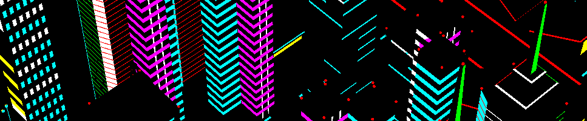

 
 <h1 align='center'>Ciao, sono Mattia!👋</h1> 
 
 

  Studente di triennale presso <a href="https://www.unimore.it/en">UniMoRe</a>  

  
 - 🌱 Sto imparando: C, HTML, assembly, Batchfile, python. 
- 📫 Vuoi scrivermi? fallo a mattia.baronis1@gmail.com 
- ❌ no lean nel cap ❌ 
- ☣️ attualmente sotto esami 

# social
 [il mio profilo instagram](https://www.instagram.com/bar0xx/)
 
 [il mio profilo steam](https://steamcommunity.com/id/bar0x/)
 
 

<!---
--->
